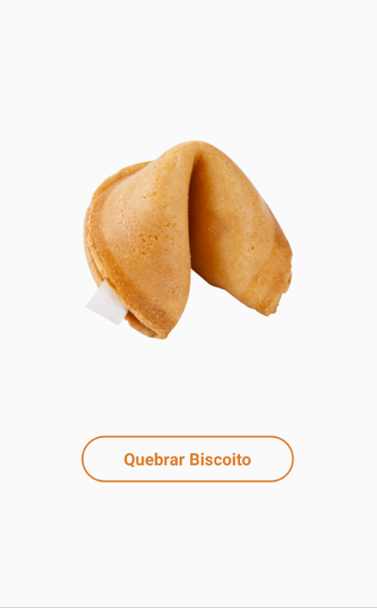
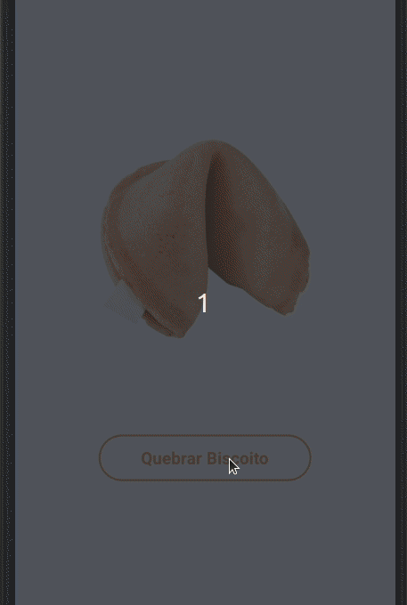

<h1 style="text-align: center; font-weight: bold;">Biscoito da Sorte</h1>

## Demo 📸

<div align="center" >
  
   
</div>

---

## Sobre o Projeto

Esta aplicação foi desenvolvida para fins de estudo.

O App Biscoito da Sorte foi criado para mostrar o uso dos componentes de classe no React Native.

Para ver o **App Mobile**, clique aqui: [Biscoito da Sorte](https://github.com/leandrosuy/appBiscoito)

### 🛠 Tecnologias

As seguintes ferramentas foram usadas na construção do projeto:

- [React](https://pt-br.reactjs.org/)
- [React Native](https://reactnative.dev/)

---

Antes de começar, você vai precisar ter instalado em sua máquina as seguintes ferramentas:
[Git](https://git-scm.com), [Node.js](https://nodejs.org/en/).
Além disto é bom ter um editor para trabalhar com o código como [VSCode](https://code.visualstudio.com/)

### 🎲 Rodando o Mobile

```bash
# Clone este repositório
$ git clone https://github.com/leandrosuy/appBiscoito.git

# Acesse a pasta do projeto no terminal/cmd
$ cd Mobile

# Instale as dependências
$ yarn
# ou
$ npm install

# Execute a aplicação em modo de desenvolvimento
$ yarn start
# ou
$ npx react-native run-android

```

<a href="https://raw.githubusercontent.com/ARTHURPC03/Proffy-FullStack/master/github/linkedin.png">
</a>
<br />

Veja meu Linkedin: [Leandro Dantas](https://www.linkedin.com/in/leandro-dantas-1959b711b/)